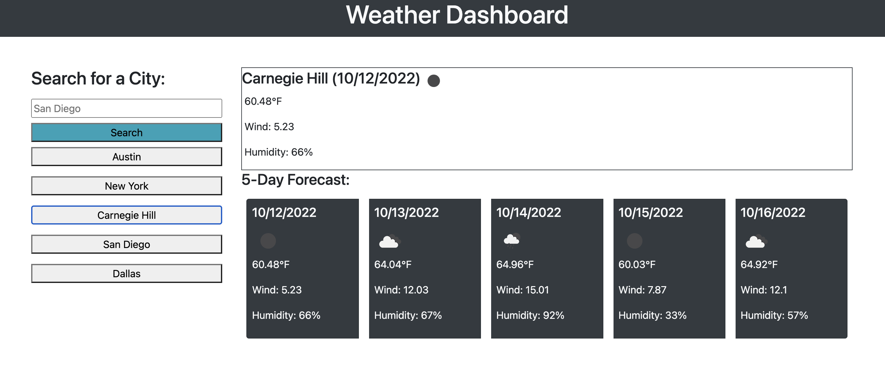

# Weather Forecast
This user program allows a user to search by a city name to display a 5 day weather outlook. 

The site also allows for the 5 most recent search queries to be stored in the local storage and when clicked will display the saved history of those recently search cities.

(GitHub Challenge 6 Live Site)(https://drewsparker.github.io/ChallengeSixWeather)

## Future Enhancements
Getting the time zones working appropriately.
